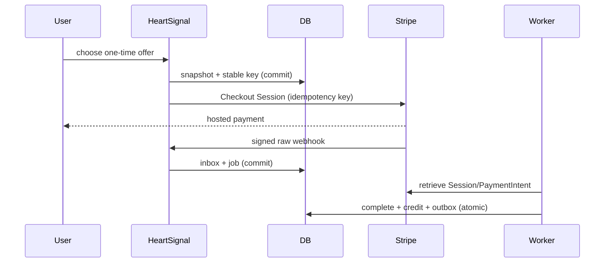
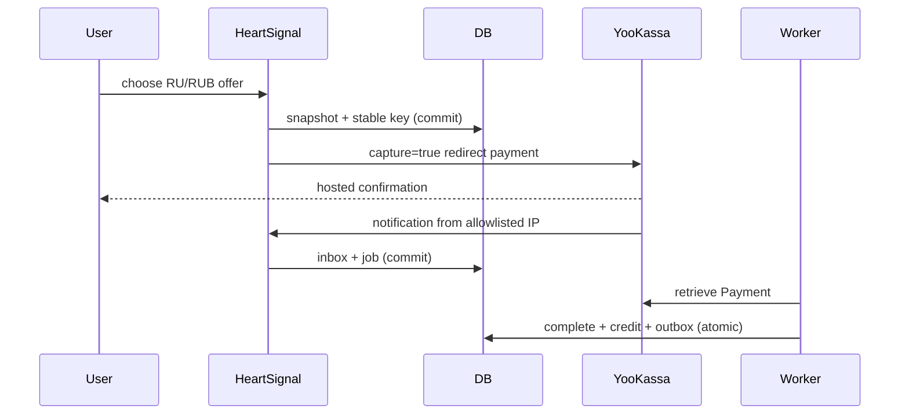

# Production one-time payments

Billing is disabled by default. `RU/RUB` routes to YooKassa; `INTERNATIONAL/EUR` and
`INTERNATIONAL/USD` route to Stripe. The server catalog owns amount, credits, provider,
currency, product version and Stripe Price ID. Subscription offers are rejected.

Stripe uses hosted Checkout in `payment` mode. YooKassa uses a captured, one-stage
redirect payment. Return and cancel URLs derive only from `PAYMENT_PUBLIC_BASE_URL`; the
return page reads internal state and is never evidence of payment.

Each order receives `checkout:create:{order_id}:v1`. The snapshot and key commit before
the network call. A timeout leaves `unknown`, queues reconciliation, and retries the same
order and key. Receipt contacts, when enabled, are validated, stored temporarily using a
billing-specific derived encryption key, and never put in snapshots, metadata, logs, or
analytics.

