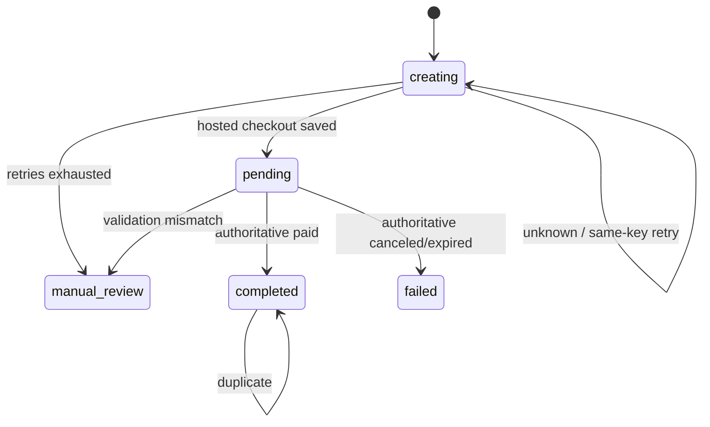
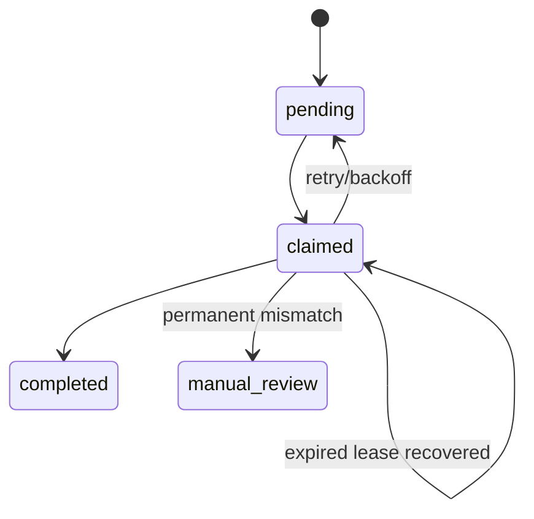
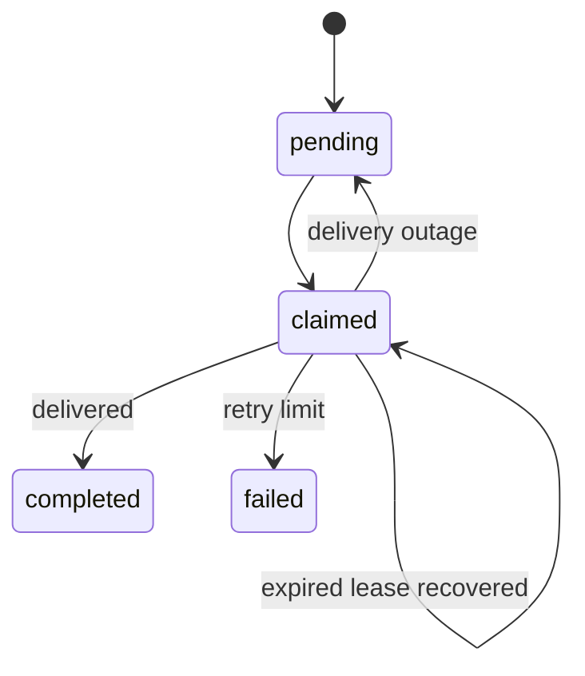

# Payment state machines

Financial locking order is `User -> PaymentOrder -> webhook/job -> CreditTransaction ->
outbox`. Provider retrieval happens before that transaction. A unique purchase key and
payment identities make completion exactly once under webhook/reconciliation races.

Inbox and job creation share a transaction. Workers claim through PostgreSQL
`FOR UPDATE SKIP LOCKED` with expiring leases. Reconciliation covers stale creating,
unknown, old pending, expired claims, and retryable failures. It fetches authoritative
state when an ID exists, or repeats creation with the stable key after ambiguous create.
