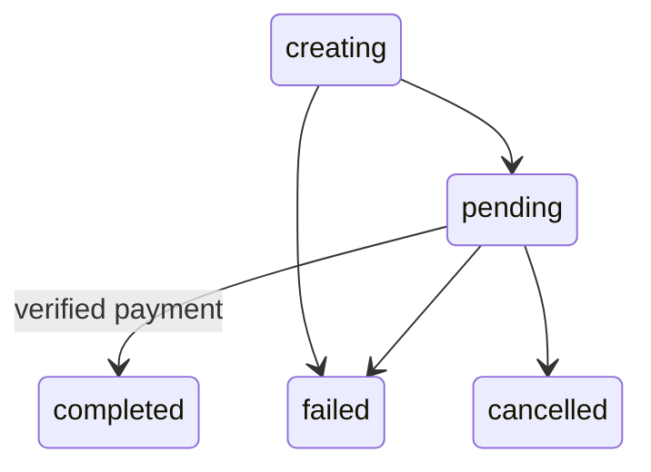
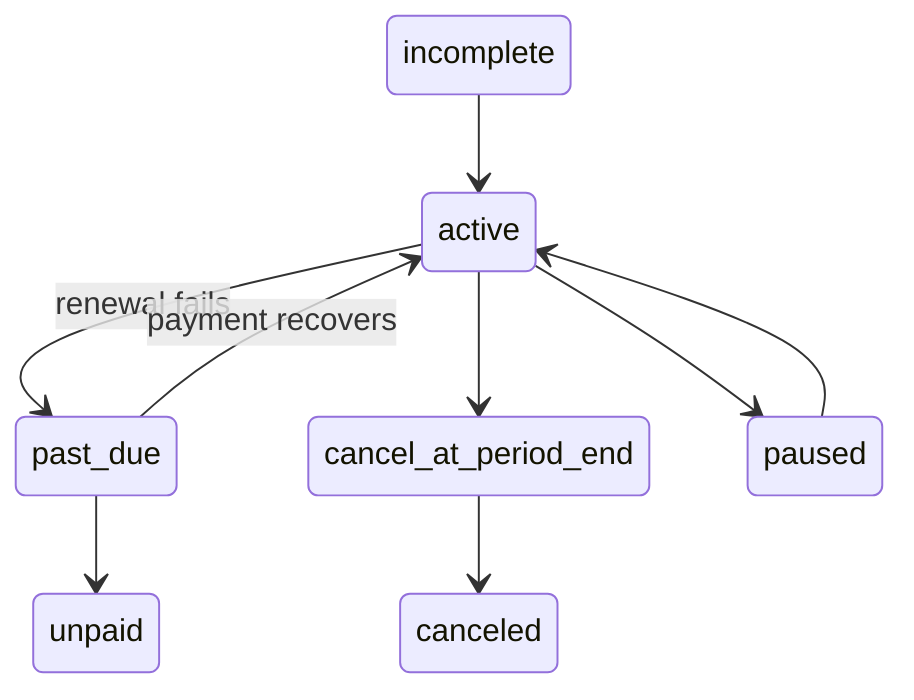
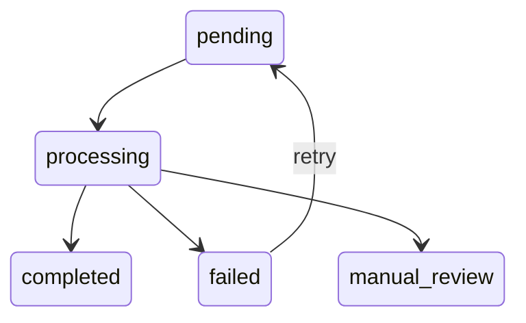
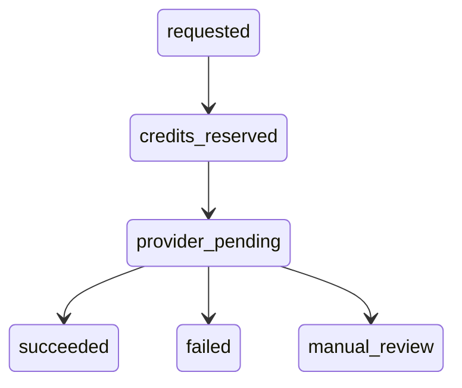
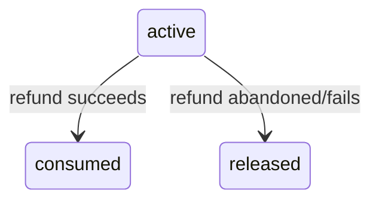
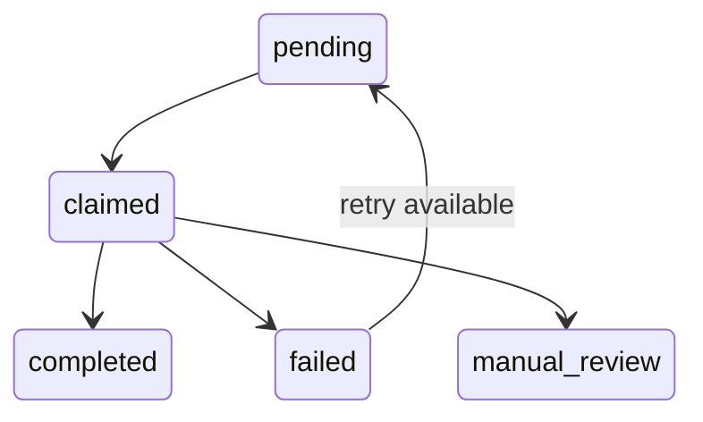

# Billing state machines

Dashed arrows are future milestones; M5B.1 supplies schemas and invariants only.

## PaymentOrder

## Subscription

All transitions above are future execution behavior.

## ProviderWebhookEvent

## RefundRequest

Provider transitions and the matching negative ledger entry are future M5B.4 behavior.

## CreditReservation

## BillingJob

Worker-driven transitions are future work; lease and availability fields make them durable.
